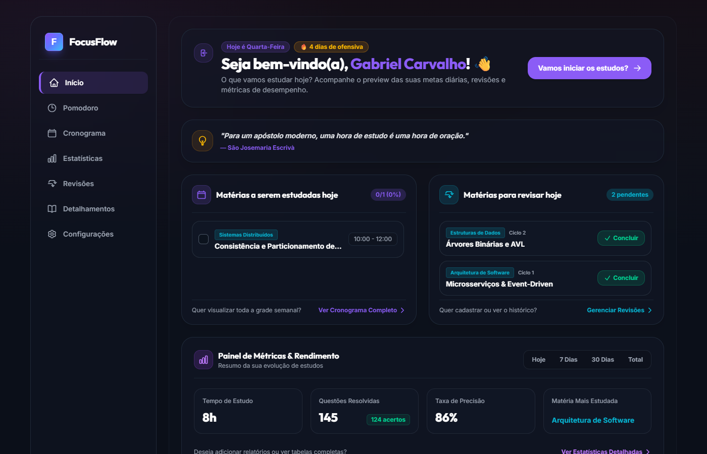
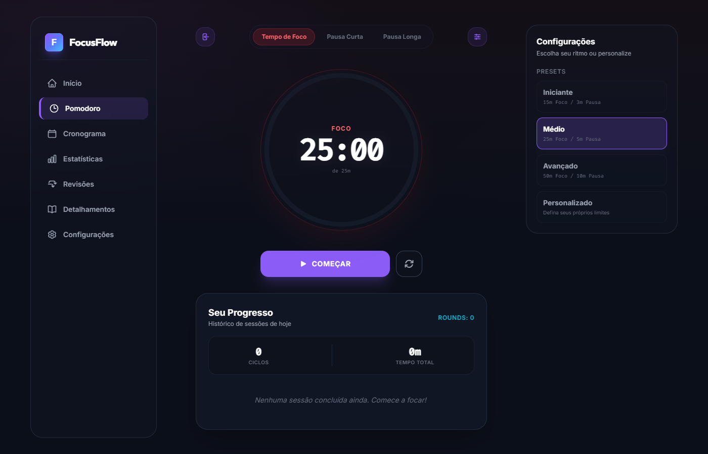
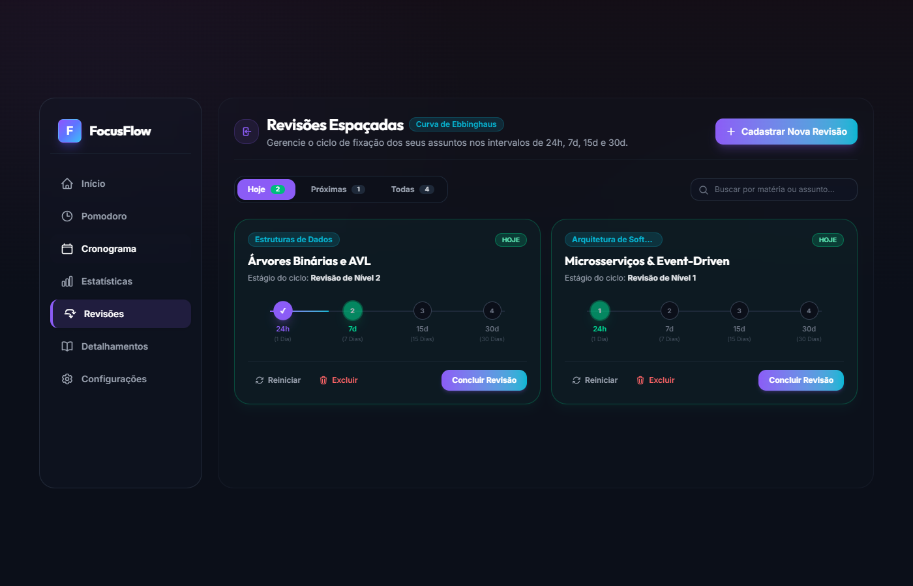
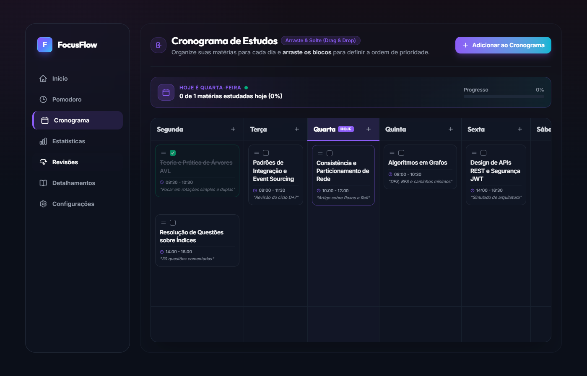
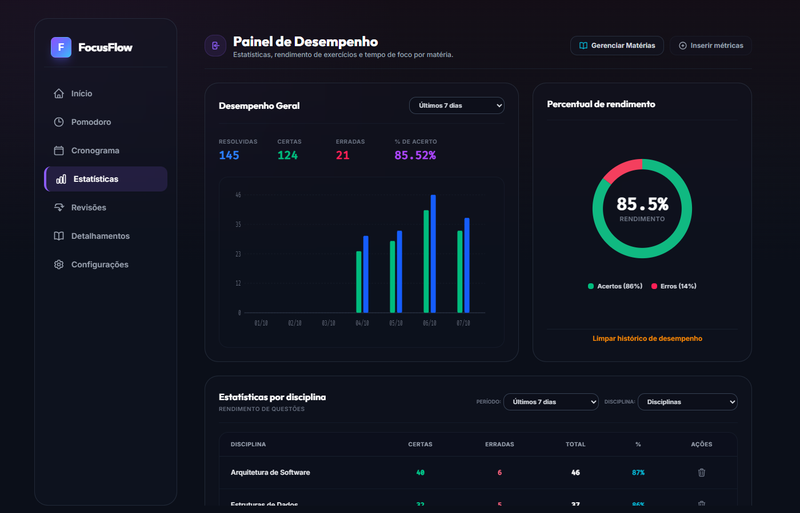
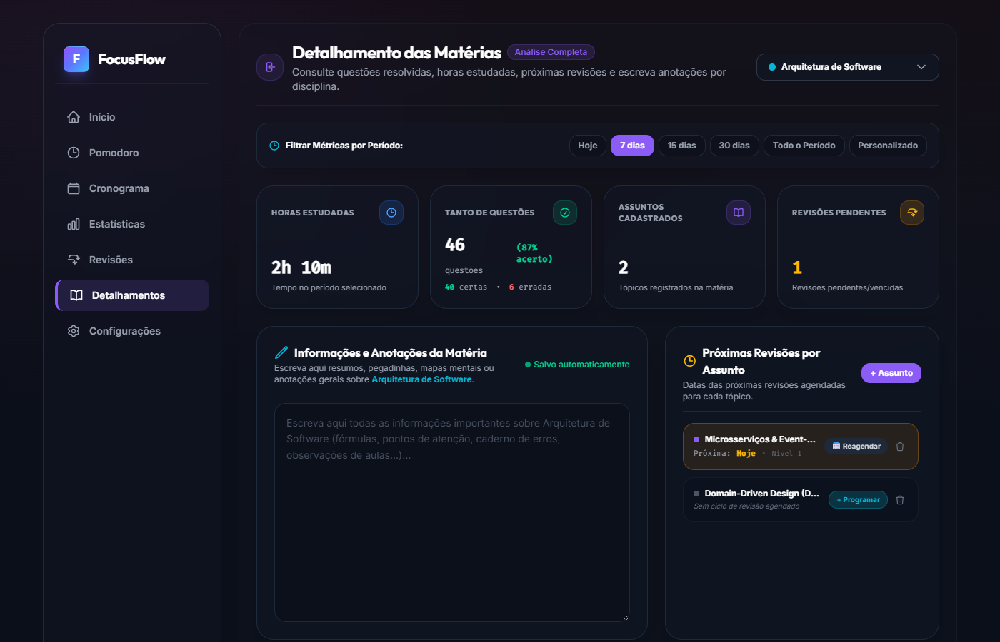
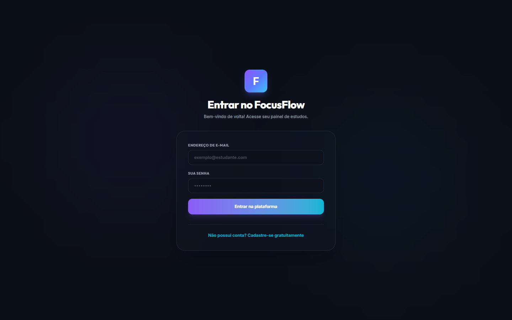
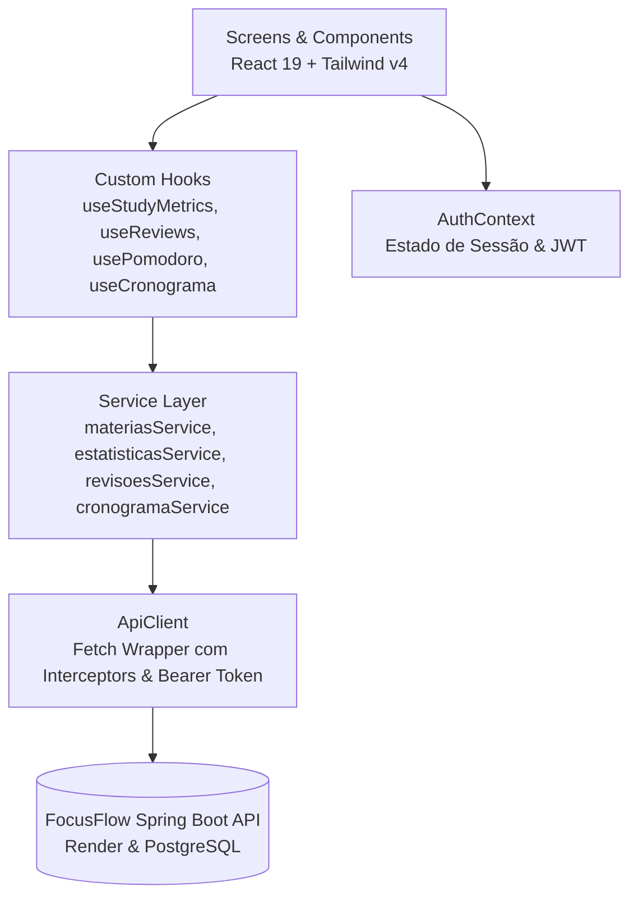

# 🧠 FocusFlow — Gerenciador Inteligente de Estudos & Produtividade

<p align="center">
  
</p>

<p align="center">
  <strong>Plataforma moderna de gestão de estudos focada em alto rendimento: Ciclos Pomodoro, Algoritmo de Repetição Espaçada (Curva de Ebbinghaus), Cronograma Semanal e Analytics de Retenção.</strong>
</p>

<p align="center">
  <a href="https://focusflow.vercel.app"></a>
  <a href="https://github.com/Crvlzin/FocusFlow-api"></a>
  
  
  
  
</p>

<p align="center">
  <a href="#-visão-geral">Visão Geral</a> •
  <a href="#-galeria-e-interface">Interface</a> •
  <a href="#-principais-funcionalidades">Funcionalidades</a> •
  <a href="#%EF%B8%8F-arquitetura-do-frontend">Arquitetura</a> •
  <a href="#-tecnologias-utilizadas">Tecnologias</a> •
  <a href="#-como-executar-o-projeto">Como Rodar</a> •
  <a href="#-variáveis-de-ambiente">Ambiente</a>
</p>

---

## 📌 Visão Geral

O **FocusFlow** é uma aplicação web completa desenvolvida para estudantes de alto rendimento (concursos públicos, vestibulares e certificações em tecnologia). Seu objetivo é combater os dois maiores desafios do aprendizado contínuo: **a falta de foco sustentável** e a **perda progressiva de memória (Curva do Esquecimento de Hermann Ebbinghaus)**.

A plataforma unifica em uma interface fluida e de estética refinada:
1. **Temporizador Pomodoro Parametrizável** integrado a registro de ciclos de foco e pausas;
2. **Motor de Repetição Espaçada** com ciclos automáticos progressivos de **24 horas**, **7 dias**, **15 dias** e **30 dias**;
3. **Cronograma Semanal Dinâmico** com suporte visual e reordenação de matérias por prioridade;
4. **Dashboard de Performance & Analytics** com acompanhamento de taxa de precisão, tempo líquido estudado, questões resolvidas (com suporte a questões em branco) e cálculo de ofensiva diária (*streak*).

O frontend foi desenvolvido com **React 19**, **TypeScript** e **Tailwind CSS v4**, consumindo uma API REST própria desacoplada construída em **Spring Boot 3 + PostgreSQL** ([FocusFlow-api](https://github.com/Crvlzin/FocusFlow-api)).

---

## 📸 Galeria e Interface

### 1. Painel Inicial (Dashboard & Ofensiva)
Acompanhamento centralizado das tarefas do dia, citações de motivação, progresso diário e atalhos rápidos.


---

### 2. Zona de Foco (Pomodoro Timer Esférico)
Relógio com representação esférica animada de progresso, alternância entre modos (Foco, Pausa Curta, Pausa Longa), presets rápidos e histórico de sessões completas.


---

### 3. Sistema de Revisões Espaçadas (Curva do Esquecimento)
Visualização em linha de progressão para cada ciclo (24h, 7d, 15d, 30d), com status dinâmico de revisões pendentes, concluídas ou em atraso.


---

### 4. Cronograma Semanal Inteligente
Planejamento semanal completo com divisão por dias da semana, horários de início/fim e acompanhamento de conclusão.


---

### 5. Métricas, Retenção & Análise de Exercícios
Gráficos de barras temporais, gráfico de rosca de taxa de aproveitamento, tempo de foco líquido acumulado e detalhamento por disciplina.


---

### 6. Detalhamento de Disciplinas & Caderno de Erros
Acompanhamento aprofundado por disciplina, contagem de tópicos registrados, bloco de anotações persistente com autosave e gerenciador de tópicos.


---

### 7. Autenticação Segura (JWT)
Tela de acesso com validação visual, proteção por rotas autenticadas e suporte a cadastro com senha criptografada via BCrypt no backend.


---

## ✨ Principais Funcionalidades

- [x] **Método Pomodoro Inteligente**:
  - Temporizador visual responsivo com indicador esférico em SVG.
  - Modos pré-calibrados: *Iniciante* (15m/3m), *Médio* (25m/5m), *Avançado* (50m/10m) e *Personalizado*.
  - Histórico de ciclos do dia armazenado de forma reativa.
- [x] **Repetição Espaçada Automatizada (SRS)**:
  - Cálculo de datas futuras a partir da data de estudo original.
  - Quatro níveis de fixação cognitiva: D+1 (24h), D+7, D+15 e D+30.
  - Controles de avanço de ciclo, reinicialização e exclusão.
- [x] **Planejador Semanal**:
  - Organização visual de segunda a domingo.
  - Indicação de dia atual com badges dinâmicos e taxa de conclusão da meta diária.
- [x] **Painel de Métricas e Produtividade**:
  - Totalização de tempo focado (horas e minutos).
  - Cálculo automático de aproveitamento: $\text{Taxa} = \frac{\text{Certas}}{\text{Total}} \times 100$.
  - Suporte completo a questões deixadas em branco sem distorcer o cálculo de precisão.
  - Sequência de dias consecutivos estudados (*Streak/Ofensiva*).
- [x] **Caderno de Anotações por Disciplina**:
  - Bloco de anotações rico por disciplina com persistência e sincronização.
- [x] **Sessão JWT Stateless**:
  - Interceptação de requisições autenticadas com `Authorization: Bearer <token>`.
  - Desconexão automática e limpeza de storage em caso de tokens expirados (401).

---

## 🏛️ Arquitetura do Frontend

O projeto adota uma arquitetura em camadas orientada a componentes (**Component-Driven Architecture**), garantindo separação rígida entre camada visual, lógica de estado, regras de domínio e comunicação HTTP:



### Estrutura de Diretórios

```
FocusFlow/
├── public/                 # Assets estáticos, favicon e ícones
├── docs/
│   └── screenshots/        # Capturas de tela em alta resolução para documentação
├── src/
│   ├── app/                # Root App e orquestrador de roteamento condicional
│   ├── components/         # Componentes visuais atômicos e modulares
│   │   ├── DashboardOverview.tsx
│   │   ├── DisciplineTable.tsx
│   │   ├── HistoryPanel.tsx
│   │   ├── Sidebar.tsx
│   │   ├── TimerControls.tsx
│   │   └── TimerDisplay.tsx
│   ├── config/             # Configurações globais e cliente HTTP (ApiClient)
│   ├── constants/          # Constantes da aplicação e citações diárias
│   ├── context/            # React Context API (AuthContext com persistência)
│   ├── hooks/              # Custom hooks isolando regras de negócio
│   │   ├── useCronograma.ts
│   │   ├── usePomodoro.ts
│   │   ├── useReviews.ts
│   │   └── useStudyMetrics.ts
│   ├── screens/            # Páginas da aplicação
│   │   ├── HomeScreen.tsx
│   │   ├── LoginScreen.tsx
│   │   ├── PomodoroScreen.tsx
│   │   ├── ReviewsScreen.tsx
│   │   ├── ScheduleScreen.tsx
│   │   ├── StatsScreen.tsx
│   │   └── SubjectDetailsScreen.tsx
│   ├── services/           # Camada de integração com os endpoints REST
│   └── types/              # Tipagem estrita TypeScript (Entidades e DTOs)
├── .env.example            # Modelo de configuração de ambiente
├── vercel.json             # Regras de rewrite SPA para deploy na Vercel
├── vite.config.ts          # Configuração de build ultra-rápido com Vite
└── package.json            # Dependências e scripts do projeto
```

---

## 🛠️ Tecnologias Utilizadas

| Tecnologia | Versão | Propósito |
| :--- | :--- | :--- |
| **React** | 19.x | Biblioteca declarativa de interface |
| **TypeScript** | 5.x | Tipagem estática estrita e prevenção de erros em tempo de compilação |
| **Vite** | 8.x | Bundler moderno com HMR instantâneo |
| **Tailwind CSS** | v4 | Estilização utilitária com design system escuro e responsivo |
| **Context API** | Nativa | Gerenciamento global de autenticação e sessão |
| **Vercel** | Edge | Hospedagem contínua com SSL automático |

---

## 💻 Como Executar o Projeto

### Pré-requisitos
- **Node.js** v18+ (recomendado v20 ou v22)
- Gerenciador de pacotes **npm** ou **yarn**
- Backend **[FocusFlow-api](https://github.com/Crvlzin/FocusFlow-api)** em execução (ou aponte para a URL de produção)

### Passo a Passo

1. **Clone o repositório:**
   ```bash
   git clone https://github.com/Crvlzin/FocusFlow.git
   cd FocusFlow
   ```

2. **Instale as dependências:**
   ```bash
   npm install
   ```

3. **Configure as variáveis de ambiente:**
   Copie o arquivo `.env.example` para `.env`:
   ```bash
   cp .env.example .env
   ```
   Edite o arquivo `.env` para definir a URL da API:
   ```env
   # Para apontar para a API local:
   VITE_API_URL=http://localhost:8080

   # Ou para apontar para a API em produção:
   # VITE_API_URL=https://focusflow-api-snij.onrender.com
   ```

4. **Inicie o servidor de desenvolvimento:**
   ```bash
   npm run dev
   ```
   O frontend estará acessível em: `http://localhost:5173`.

5. **Para gerar a build de produção:**
   ```bash
   npm run build
   npm run preview
   ```

---

## ⚙️ Variáveis de Ambiente

| Variável | Obrigatória | Valor Padrão | Descrição |
| :--- | :---: | :--- | :--- |
| `VITE_API_URL` | Sim | `https://focusflow-api-snij.onrender.com` | URL base do backend REST Spring Boot |

---

## 🔗 Repositório Relacionado

Este frontend é alimentado pelo backend:
- 📦 **[FocusFlow-api (Spring Boot 3 + PostgreSQL + Docker)](https://github.com/Crvlzin/FocusFlow-api)**

---

## 👨‍💻 Autor

Desenvolvido por **Gabriel Carvalho** (@Crvlzin).
- GitHub: [@Crvlzin](https://github.com/Crvlzin)
- Projeto: [FocusFlow Web](https://focusflow.vercel.app)

---

## 📄 Licença

Este projeto é distribuído sob a licença **MIT**. Consulte o arquivo `LICENSE` para mais detalhes.
